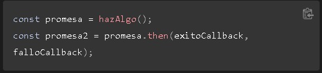

# PROGRAMACION WEB #

**NOMBRE DEL ALUMNO:**  JUAN EDUARDO GONZALEZ LEYVA

**NOMBRE DEL PROFESOR:** GERARDO PINEDA ZAPATA 

### Promesa ###

_Una promesa es un obejto que representa la terminancion o fracaso de un operacion asincorna. Dado que existen promesas ya creadas explicaremos las que estan por deafual y despúes veremos como crearlas_

_En escencia, una promesa es un objeto devuelto al cual se adjuntan funciones de callback, en lugar de pasar las llamadas a un funcion_

### Garantias ###

_A difencias de las funciones callback pasadas a un funcion (la manera antigua) una promesa trae consigo unas garantias_

1. Las funciones callback nunca seran llamdas antes de la terminacion de la ejecuciuon actual de un bucle de eventos, esto quiere decir que en la funcion se dispara al terminar el procesos que corresponde donde se salto la funcion de callback

2. Las funciones callback añadidas con then() incluso despues del exito o fracaso de la operacion asincrona seran llamadas, en este caso se ejucataran indenpedientemente si fallen o se realicen correctamente

3. Multiples funciones callback pueden ser añadidas llamando a then() varias veces. Cada una de ellas es ejecutada una seguida de la otra, en el orden el que fueron insertadas 

4. Tambien la ventaja mas crucial es el encadenamiento

### Encadenamiento ###

_Una necesidad comun es el ejecutar dos o mas operaciones asincronas seguidas, donde cada operacion posterior se inicia cuando la operacion previa tiene exito, la funcion then() devuelve una promesa nueva, diferente de la original_

_ó_

_En el segundo ejemplo (Es decir promesa 2) representa no solo la terminacion de hazAlgo(), sino tambien de exitoCallback ó falloCallback que colocamos, las cuales pueden ser otras funciones asincronas devolviendo una promesa. Cuando ese es el caso, cualquiuer funcion callBack añadida a promesa 2 se queda en cola destras de la promesa devuelta por exito Callback ó falloCallback._